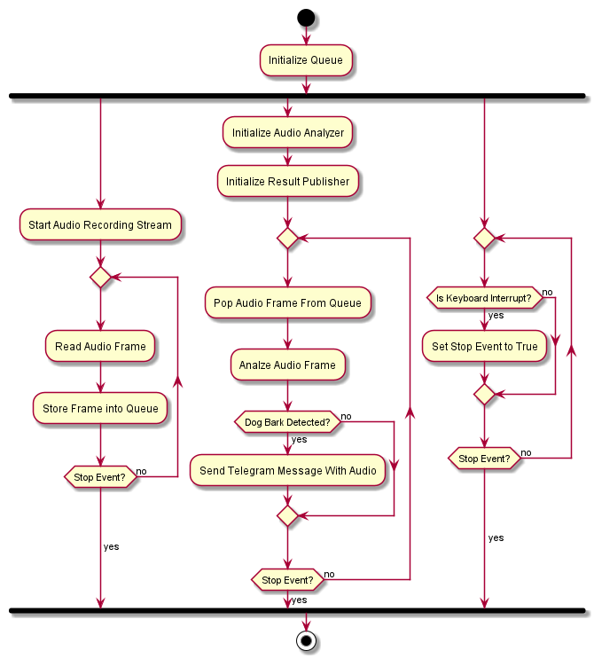

# Dog Barking Detection

## Motivation & General Overview

The intend of writing this program is to have some alternative to the existing Dog Barking Warning Systems
which is less restrictive and more flexible.

Existing Montioring Systems requireing abonnents and are realized via smartphone app and so one of user' s devices needs
to be left at home to monitor the animal. 

For learning purposes and to be independent of the above downsides another solution is created with this application.
The program can be run on a single small embedded device like Raspberry Pie 3. All you need is a cheap room microphone
with sufficient sensitivtiy.

__The program is written in plain python3 and has the following features:__
* Detecting when the dog is barking through the microphone and machine learning binary audio classification techniques
* Notifying the user via instant messaging service (currently Telegram is supported)
* Sending the recorded and detected dog bark audio clip via instant messaging service to the user
* Setup and configuration via config file

## Workflow

The following UML activity diagram shows the workflow of the Dog Barking Detection app:



## How To Setup

__Prerequisites:__

* < Python3.11 => Python3.10.9 is recommended
* GCC or clang compiler (recommended clang-13.x.x)
* Newest pip version (to update, run `python3 -m pip install pip --upgrade`)
* virtualenv for Python3.10 (if not installed perform `python3 -m pip install virtualenv`)

Perform the following steps to install the program on your envrionment:

Create virtual environment using virtualenv:

```
cd DogBarkingDetection/
virtualenv env
source env/bin/activate
```

Download pyaudio-0.2.8 package manually:

```
wget -c 
http://people.csail.mit.edu/hubert/pyaudio/packages/pyaudio-0.2.8.tar.gz
tar zxf pyaudio-0.2.8.tar.gz
cd PyAudio-0.2.8/
```

Download portaudio-v19 (stable version):

```
wget -c http://www.portaudio.com/archives/pa_stable_v19_20140130.tgz
tar zxf pa_stable_v19_20140130.tgz
mv portaudio portaudio-v19
cd portaudio-v19
./configure
make
cd ../
```

If errors with unused variables are output and the make command fails then you can deactivate
the functionality that the compiler treats warnings as errors by editing the *configure* file,
searching for "Werror" and removing this compiler flag inside this file. After that perform
`make` commmand again and it should be successfull.

Finish Pyaudio setup:

Stay inside PyAudio-0.2.8/ folder and continue with the following commands:

```
export CFLAGS="-I `pwd`/portaudio-v19/include/ -L 
`pwd`/portaudio-v19/lib/.libs/"
python3 setup.py build --static-link
python3 setup.py install
```

Test the Pyaudio import:

```
python3
>>> import pyaudio
>>>
```
The import of pyaudio should be successfull now.

Install Tensorflow and other required packages:

```
python3 -m pip install tensorflow-macos tensorflow-metal librosa numpy
```
**Note:** If you are using Windows or Linux and not MacOS, please perform the correct install steps for your environment to install current tensorflow verison.

## Add credentials to the config file

To receive notifications via Telegram when the dog is barking, including the audio of the barking, add your Telegram access token and chat id after setting up the Telegram chat bot allowing to send messages via the Telegram API. Follow the steps provided by the Telegram chat bot service built into the Telegram app to set up a new token and chat id.

```shell
[PUBLISHER]
token= # access token of telegram bot
chat_id= # chat id of telegram chat including the '-' in front of the id
max_retries=3 # max retries of http requests when sending result
title_bark_audio=bark # bark.wav, .wav is appended automatically
startup_msg=Dog Bark Detection started. # receive a message when the app starts
msg=Dog is barking. # message that is sent into the Telegram chat when the dog is barking
```

You can also change the other parameters in the `config.conf` file, but the defaults should be fine.

## How To Run

```
cd src/
python3 main.cpp
```

## Outcome

Better than starting from scratch for AI-based audio analysis for dog bark detection is to fine-tune an existing model like `YAMnet`. Yamnet can already detect dog barking, which is labeled as a general `animal` sound. I am currently fine-tuning `YAMnet` locally to accurately detect dog barking.